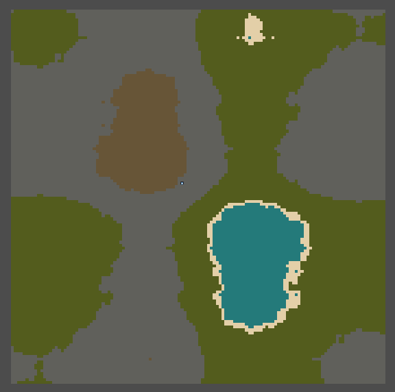
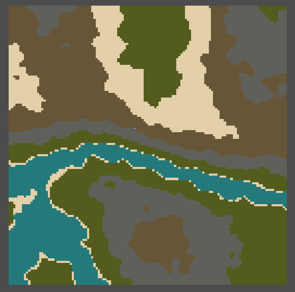

# SoftNoise-GDScript-
GDScript function set generating noise (value noise, perlin noise, opensimplex(2d, 3d and 4d)...).

## Example of how to use:

*other_script.gd*

```
extends Node

var preScript = preload("res://scripts/softnoise.gd")
var softnoise

func _ready():
	#Random
	softnoise = preScript.SoftNoise.new()
	#Passing a seed
	softnoise = preScript.SoftNoise.new(1729)
	
	softnoise.simple_noise1d(x)
	softnoise.simple_noise2d(x, y)
	
	softnoise.value_noise2d(x, y)
	softnoise.perlin_noise2d(x, y)
	
	softnoise.openSimplex2D(x, y)
	softnoise.openSimplex3D(x, y, z)
	softnoise.openSimplex4D(x, y, z, w)
	
	
```
### Preview
Map generated using the **perlin_noise2d()** function.



Map generated using the **openSimplex2D()** function.




